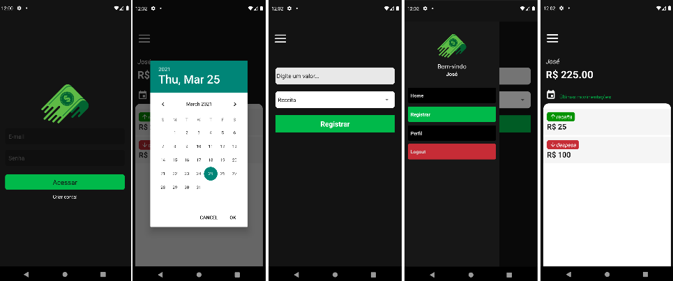

# Finances

A personal finance mobile app built with React Native and Firebase. Users can sign up, log in, and record income or expenses — with real-time balance updates and transaction history filtered by date.



## 🚀 Technologies

| Tool | Version |
|---|---|
| React Native | 0.63.4 |
| React | 16.13.1 |
| Firebase (Auth + Realtime Database) | 8.2.5 |
| React Navigation (Stack + Drawer) | 5.x |
| styled-components | 5.2.1 |
| react-native-vector-icons | 8.0.0 |
| date-fns | 2.17.0 |
| AsyncStorage | 1.13.4 |

## 📋 Prerequisites

- Node.js >= 12
- Yarn or npm
- React Native CLI (`npm install -g react-native-cli`)
- **Android:** Android Studio + Android SDK (API 29+) + emulator or physical device
- **iOS (Mac only):** Xcode 12+ + CocoaPods (`sudo gem install cocoapods`)
- A Firebase project with Authentication (email/password) and Realtime Database enabled

## ⚙️ How to Run

### 1. Clone and install dependencies

```bash
git clone https://github.com/JoseGu1llardi/finances.git
cd finances
yarn install
# or
npm install
```

### 2. iOS only — install pods

```bash
cd ios && pod install && cd ..
```

### 3. Configure Firebase

The file `src/services/firebaseConnection.js` contains the Firebase config. Replace it with your own project credentials from the [Firebase Console](https://console.firebase.google.com/):

```js
let firebaseConfig = {
  apiKey: "YOUR_API_KEY",
  authDomain: "YOUR_PROJECT.firebaseapp.com",
  databaseURL: "https://YOUR_PROJECT-default-rtdb.firebaseio.com",
  projectId: "YOUR_PROJECT",
  storageBucket: "YOUR_PROJECT.appspot.com",
  messagingSenderId: "YOUR_SENDER_ID",
  appId: "YOUR_APP_ID",
};
```

Also make sure your Firebase Realtime Database rules allow authenticated reads/writes.

### 4. Start Metro bundler

```bash
yarn start
# or
npx react-native start
```

### 5. Run on device/emulator

```bash
# Android
yarn android
# or
npx react-native run-android

# iOS
yarn ios
# or
npx react-native run-ios
```

## 🏗️ Project Structure

```
src/
├── assets/          # App logo
├── components/
│   ├── CustomDrawer/  # Side drawer with username and logout
│   ├── DatePicker/    # Date selector for filtering history
│   ├── Header/        # Top bar component
│   ├── HistoricList/  # Single transaction row
│   └── Picker/        # Income/expense type selector (Android + iOS)
├── contexts/
│   └── auth.js        # Auth state and methods (signUp, signIn, signOut)
├── pages/
│   ├── Home/          # Transaction list + balance display
│   ├── New/           # Add income or expense
│   ├── Profile/       # User info and logout
│   ├── SignIn/        # Login screen
│   └── SignUp/        # Registration screen
├── routes/
│   ├── index.js       # Switches between auth and app routes
│   ├── auth.routes.js # Stack: SignIn → SignUp
│   └── app.routes.js  # Drawer: Home, New, Profile
└── services/
    └── firebaseConnection.js  # Firebase initialization
```

### Firebase data shape

```
users/
  {uid}/
    nome: string
    email: string
    saldo: number

historico/
  {uid}/
    {key}/
      tipo: "receita" | "despesa"
      valor: number
      date: "dd/MM/yyyy"
```

## 📌 Project Status

- [x] In development / study project

## 👤 Author

**José Wellington Ribeiro**
GitHub: [https://github.com/JoseGu1llardi](https://github.com/JoseGu1llardi)
